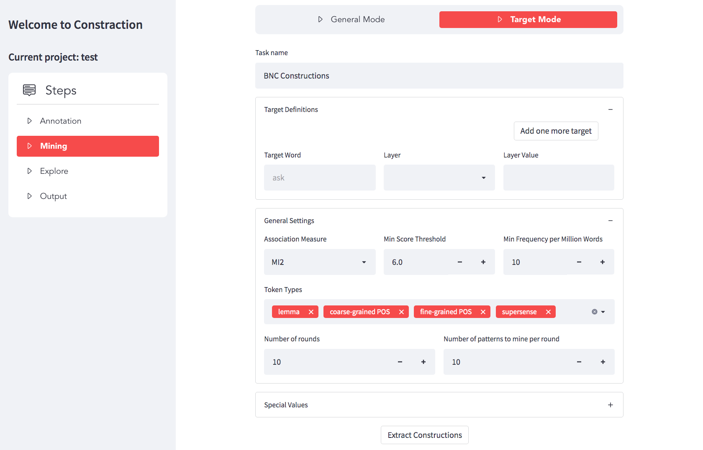
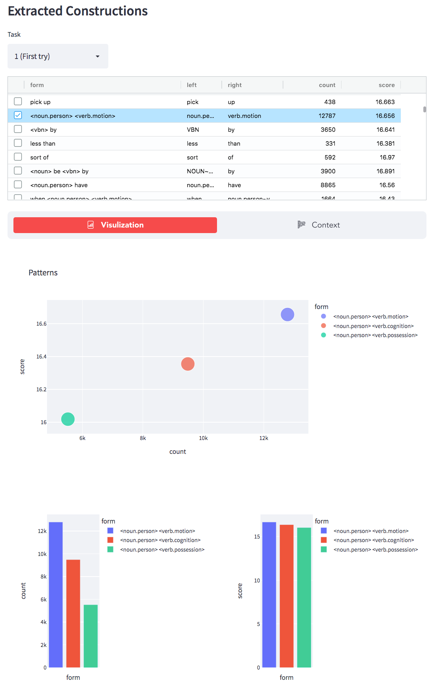
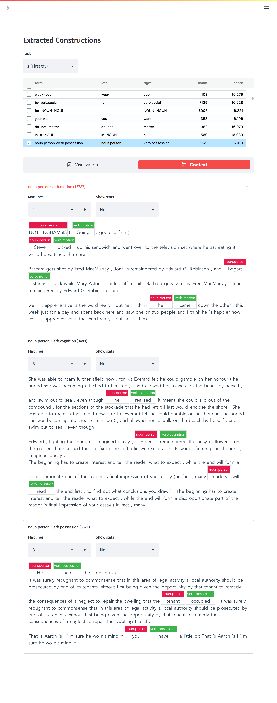

# Constraction
Constraction is an open-source tool for the automatic extraction and interactive exploration of linguistic constructions from arbitrary textual corpora. Constraction can take as input textual data with zero or more layers of linguistic annotation (lexical, syntactic and semantic)), and extract as output constructions of varying sizes and with different levels of abstraction.
It comes with a browser-based interface which exposes configurable parameters for fine-tuning the extraction process. The interface also enables visual, interactive exploration of the extracted constructions.
This repository currently houses the original version of Constraction first developed in 2021. We are in the process of migrating a newer version to a more flexible architecture.

Constraction is developed in Python, with core extraction functions optimized using [Nim](https://nim-lang.org), a highly efficient compiled programming language with Python-like syntax. Constraction uses the [spaCy](https://spacy.io/) library to extract multiple layers of annotation including token lemmas, parts-of-speech (with fine-grained and coarse-grained tagsets) and syntactic dependency relationships. For semantic annotation supersense (coarse-grained semantic senses), Constraction utilizes annotators from the [BookNLP](https://github.com/booknlp/booknlp) library and integrates its results with spaCy annotations.

## Installation
To install, first download the repository, and compile the Nim source code for your environment. Then use pip to install Python dependencies including spaCy, BookNLP and Streamlit. Finally, run the server with the `streamlit` command and browse the frontend interface (default address: http://localhost:8501). Prepare your text files in the data folder and run annotator.py to annotate them, generating a json file for use in subsequent analysis.
Note that Nim 1.6.0+ and Python 3.7+ are required for compilation and execution. 
```
git clone https://github.com/victoryhb/constraction.git
cd constraction/src
nim c --threads:on --app:lib -d:danger --opt:speed -d:nimStrictDelete --gc:orc --out:mining.so mining
pip install spacy booknlp sqlmodel pandas plotly streamlit streamlit-option-menu streamlit-text-annotation streamlit-aggrid
python -m spacy download en_core_web_sm
python annotator.py "path/to/text/folder/" "path/to/output/folder/patterns.json"
streamlit run server.py
```

## Screenshots




## License
    GNU GENERAL PUBLIC LICENSE, Version 3
    Constraction  Copyright (C) 2022  Hengbin Yan
    This program is free software: you can redistribute it and/or modify
    it under the terms of the GNU General Public License as published by
    the Free Software Foundation, either version 3 of the License, or
    (at your option) any later version.

    This program is distributed in the hope that it will be useful,
    but WITHOUT ANY WARRANTY; without even the implied warranty of
    MERCHANTABILITY or FITNESS FOR A PARTICULAR PURPOSE.  See the
    GNU General Public License for more details.

    You should have received a copy of the GNU General Public License
    along with this program.  If not, see <http://www.gnu.org/licenses/>.

## Contact
If you have any questions, comments, bug reports, or suggestions for improvements,
please file an issue directly on this Github repository.
